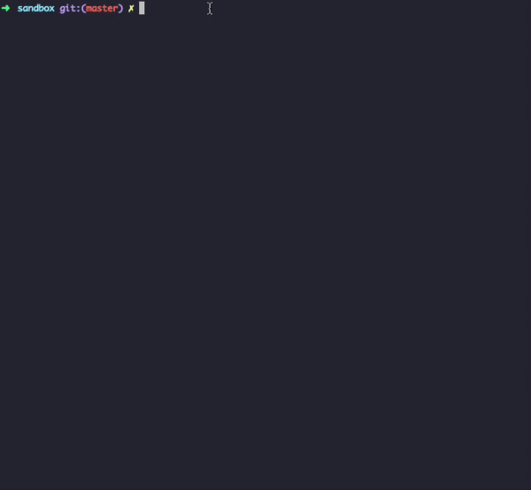

# Github Releaser
Bump version, generate changelog with issue links, commit, tag, push and create Github release, all automatically.

<p align="center"></p>	

## Getting Started
* Add the api url to your `package.json`:
```json
"repository": {
    "apiUrl": "https://api.github.com/repos/<your username>/<your repo name>"
},
```

* Create a Github access token to use for your repo. It will be needed in order to create releases.